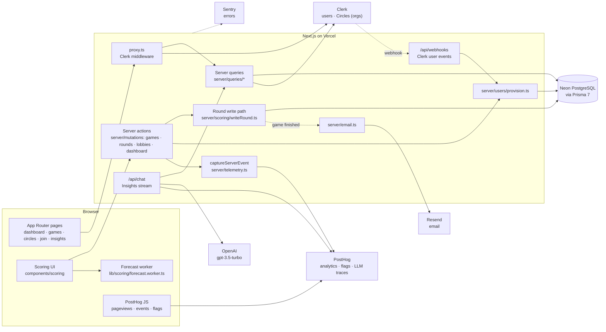
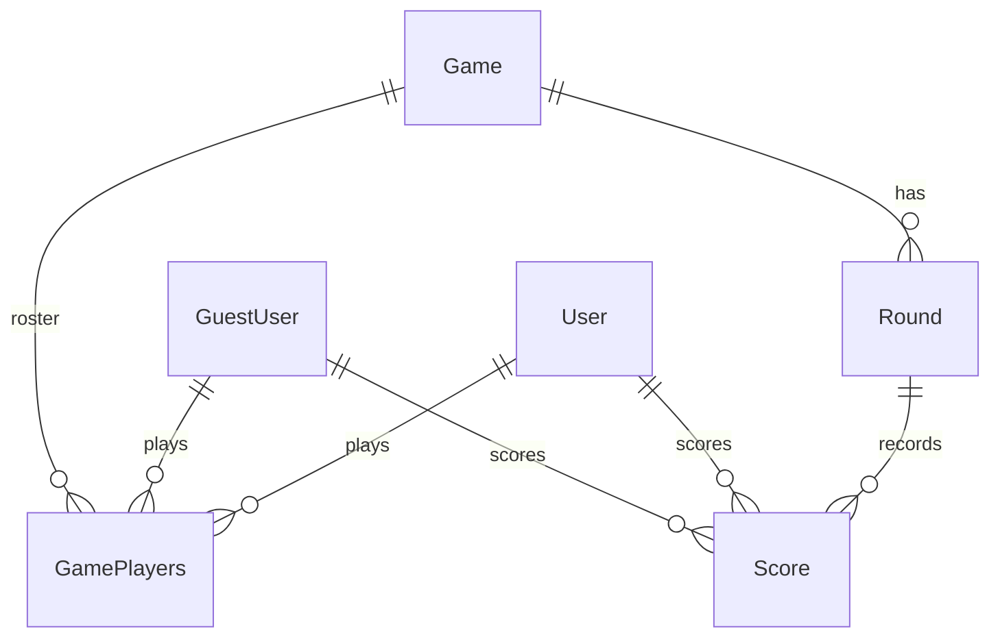

# Architecture

How Blitzer's pieces fit together. [README.md](../README.md) covers setup and product contracts; [CLAUDE.md](../CLAUDE.md) covers code ownership. This page is the map between them (#75).

## Request paths

**Viewing.** Pages are server components that call `server/queries/<domain>` directly, which read PostgreSQL through Prisma. Circle membership comes from Clerk (`server/clerkOrgs.ts`). Public game links render a spectator view; no write affordances are shown and none are trusted on the server.

**Scoring.** The client keeps the round draft (`useScoringDraft`) and calls the `rounds` server actions. Both create and edit go through `server/scoring/writeRound.ts`, which locks the game row, re-checks authorization, validates the roster and limits, compares the round revision, writes scores, and recomputes completion in one transaction. When a save finishes a game, completion emails are scheduled after the response.

**Forecasts.** Win-probability forecasts run in a Web Worker in the browser using bounded historical samples loaded with the page, so they never block score entry. See [performance/forecast-worker.md](performance/forecast-worker.md).

**Pickup games.** A host creates a lobby (`mutations/lobbies.ts`); players join by link or code, which provisions their local user if the Clerk webhook has not arrived yet. The host starts the game, after which participants can score.

**Identity.** Clerk owns sign-in and Circles. `/api/webhooks` verifies the Clerk signature and provisions or updates the local `User` by immutable Clerk user ID. Guests (`GuestUser`) have no login and exist only as game participants.

**Dashboard.** The dashboard loads everything through `getDashboard` in `queries/stats.ts`, which builds on the shared bounded aggregates in `queries/playerStats.ts`. Each user's card order and hidden cards are saved on their `User` row through `mutations/dashboard.ts`.

**Insights.** Everything AI is gated by the `llm-features` flag and traced to PostHog in privacy mode. `/api/chat` builds a system prompt from the caller's aggregate stats plus `queries/playerHighlights.ts` (rivals, streaks, comebacks) and streams a reply from OpenAI. Finished games get a story from `ai/gameStory.ts`, written from the stored rounds and `lib/scoring/gameHighlights.ts`, cached in `GameStory` until a round revision changes; the completion email reuses it for flagged recipients, or writes a personal version for players who saved a story style on Insights. Between rounds, `/api/games/[gameId]/recap` writes a short announcer recap from the standings and `queries/rosterHistory.ts`, and the browser reads it aloud with speech synthesis.

## Data model

A `Game` is `CIRCLE`, `PICKUP` or `LEGACY`. A round score is `totalCardsPlayed − 2 × blitzPileRemaining`; the formula lives once in `lib/validation/gameRules.ts` and is shared with SQL aggregates. Players who prefer "Do math" mode (`User.scoreEntryMode = TOTAL`) type the round total instead: it is stored in `Score.typedScore` with a null breakdown, and stats that need cards or Blitz piles (blitz rates, the Blitz Pile graph, forecast mechanics) count only rounds that have a breakdown.

## Observability

Server product events go through `captureServerEvent`, which delivers inside Next's `after` lifetime so analytics never fails a committed write. The event list lives in [analytics-events.md](analytics-events.md). Errors go to Sentry with route context; see [error-tracking.md](error-tracking.md) and [llm-observability.md](llm-observability.md).
