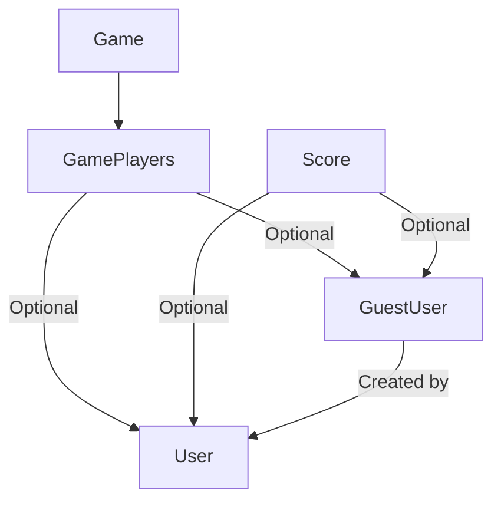

# System Patterns for Blitzer

## System Architecture Overview

Blitzer is built on a Next.js framework with a hybrid rendering approach. The current architecture can be characterized as follows:

```
[Client Browser] <--> [Next.js Framework]
                          |
                          v
     [Server Components / Client Components]
                          |
                          v
       [Server Actions / API Routes]
                          |
                          v
            [Prisma ORM Client]
                          |
                          v
        [PostgreSQL Database (Neon)]
```

The application uses:

- Next.js App Router for routing and rendering
- React Server Components for server-rendered UI
- Client Components for interactive elements
- A mix of Server Actions and API Routes for data operations
- Prisma ORM for database interactions
- Clerk for authentication and user management

## Key Technical Decisions

### Next.js App Router Architecture

**Decision**: Use Next.js App Router over Pages Router
**Rationale**:

- Better performance through Server Components
- More flexible routing options
- Built-in support for layout nesting
- Better alignment with the future of Next.js

### Authentication with Clerk

**Decision**: Use Clerk over custom auth solution or alternatives
**Rationale**:

- Comprehensive user management without custom code
- Solid security practices built-in
- Well-maintained and regularly updated
- Good integration with Next.js

### Database Hosting with Neon

**Decision**: Use Neon PostgreSQL over alternatives
**Rationale**:

- Serverless PostgreSQL reduces operational complexity
- Compatibility with Prisma ORM
- Strong performance characteristics
- Built-in scaling capabilities

### UI Component Library with ShadCN UI

**Decision**: Use ShadCN UI over other UI frameworks
**Rationale**:

- Customizable and unstyled components
- Compatible with Tailwind CSS
- No runtime dependencies
- Community-driven and actively maintained

## Design Patterns in Use

### Pattern: Error Tracking with PostHog

Blitzer implements a layered error tracking system using both PostHog and Sentry:

```
                        [Application Error]
                               |
                               v
         ┌───────────────────────────────────────┐
         │             Error Sources             │
         └───────────────────────────────────────┘
                 |             |           |
                 v             v           v
         ┌─────────────┐ ┌─────────┐ ┌───────────┐
         │    Global   │ │Component│ │  Server   │
         │    Error    │ │  Error  │ │   Error   │
         │   Boundary  │ │ Boundary│ │  Handler  │
         └──────┬──────┘ └────┬────┘ └─────┬─────┘
                |              |            |
                v              v            v
         ┌───────────────────────────────────────┐
         │       Context Enrichment Layer        │
         └──────────────────┬────────────────────┘
                            |
                            v
                 ┌────────────────────┐
                 │ Error Tracking API │
                 └─────────┬──────────┘
                           |
                 ┌─────────┴──────────┐
          ┌──────┴──────┐      ┌──────┴──────┐
          │   PostHog   │      │   Sentry    │
          │  Exception  │      │  Exception  │
          │   Capture   │      │   Capture   │
          └─────────────┘      └─────────────┘
```

This pattern enables:

- Comprehensive error capture across all application layers
- Rich context with every error (user, component, game state, etc.)
- Dual tracking in both PostHog and Sentry
- User-friendly error recovery interfaces
- Centralized error monitoring and analysis

Implementation details:

- Global error boundary in `global-error.tsx`
- Section-level error boundaries for key application areas
- Component error boundaries with context enrichment
- Server-side error tracking in `instrumentation.ts`
- Extraction of user identity from cookies when available
- Context-specific error recovery UIs
- Detailed error tracking documentation

### Pattern: LLM Observability with PostHog

Blitzer implements LLM observability for monitoring and analyzing AI chat interactions using PostHog:

```
[User Chat Input] --> [ModernChatUI] --> [Chat API Route]
                                           |
                                           v
[PostHog Dashboard] <-- [LLM Metrics] <-- [withTracing Wrapper]
                                           |
                                           v
                                    [OpenAI Model] --> [Response]
```

This pattern enables:

- Tracking of input/output tokens and costs
- Measurement of LLM response latency
- Analysis of user queries and AI responses
- Error monitoring for LLM interactions
- Addition of user context to AI interactions

Implementation details:

- PostHog's `@posthog/ai` package with `withTracing` wrapper
- User and conversation context enrichment
- Error capture with comprehensive context
- Asynchronous metric collection

### Pattern: Server-Side Rendering with Hydration

Blitzer uses Server Components for initial page renders with client hydration for interactive elements:

```
[Server Render] --> [HTML Delivery] --> [Client Hydration]
```

Benefits:

- Faster initial page loads
- Better SEO
- Reduced JavaScript bundle size
- Progressive enhancement

### Pattern: Data Access Layer

Data access is abstracted through a layer of utility functions in the `/server` directory:

```
[Component] --> [Server Action/API] --> [Data Access Functions] --> [Prisma ORM]
```

Benefits:

- Consistent data access patterns
- Reduced duplication of query logic
- Centralized error handling
- Easier testing and mocking

### Pattern: Feature-based Component Organization

Components are organized by feature within the app directory:

- `/app/games/` - Game-related pages and components
- `/app/friends/` - Friend management components
- `/app/dashboard/` - Dashboard and analytics components

Benefits:

- Collocated code for easier navigation
- Clear ownership of features
- Reduced cross-feature dependencies

### Pattern: Shared UI Component Library

Common UI components are centralized in `/components/ui`:

```
[Feature Components] --> [Shared UI Components] --> [Base HTML/CSS]
```

Benefits:

- Consistent UI across the application
- Reduced duplication of styling and behavior
- Improved maintenance through centralization

### Pattern: Feature Flag Management

Blitzer uses PostHog for feature flag management, with a consistent implementation pattern:

```
                      ┌───────────────────┐
                      │   PostHog Dashboard   │
                      │  (Flag Configuration) │
                      └─────────┬─────────┘
                                │
                 ┌──────────────┴─────────────┐
                 │                            │
    ┌────────────▼─────────────┐   ┌─────────▼────────────┐
    │   Server-side flag API   │   │   Client-side hooks  │
    │  (PostHog Node client)   │   │   (PostHog React)    │
    └────────────┬─────────────┘   └─────────┬────────────┘
                 │                            │
    ┌────────────▼─────────────┐   ┌─────────▼────────────┐
    │  Server Components       │   │   Client Components   │
    └──────────────────────────┘   └──────────────────────┘
```

Benefits:

- Centralized flag management in PostHog dashboard
- Consistent API for both server and client components
- User-based flag targeting using Clerk authentication
- Type-safe feature flag implementation

### Pattern: Guest Player Integration

Blitzer implements a polymorphic relationship pattern for handling both registered and guest users:



This pattern enables:

- Supporting non-registered players in games
- Maintaining data integrity with explicit relationships
- Preserving proper foreign key constraints
- Providing clear attribution of guest players to creators
- Facilitating guest-to-registered user conversion

Implementation details:

- Prisma schema with optional relations
- CHECK constraints to ensure either userId or guestId is present
- Database transactions for data integrity during operations
- Indexes for performance optimization
- Feature flag control for phased rollout

The guest player system is implemented in three phases:

1. Core guest player creation and participation
2. Guest management and statistics integration
3. Conversion path from guest to registered user

For detailed implementation plan, see `memory-bank/features/guest-players.md`.

## Component Relationships and Data Flow

### Core Data Flow

```
[User Input] --> [Client Component] --> [Server Action/API Route] -->
[Data Access Layer] --> [Database] --> [Response] --> [UI Update]
```

### Authentication Flow

```
[Login Request] --> [Clerk Auth] --> [Session Token] -->
[Protected Routes] --> [Data Access with User Context]
```

### Game Scoring Flow

```
[Score Entry UI] --> [Score Validation] --> [Save Score Action] -->
[Database Update] --> [Stats Recalculation] --> [UI Update]
```

### Friends Management Flow

```
[Friend Request UI] --> [Request Action] --> [Notification Creation] -->
[Recipient Notification] --> [Accept/Reject Action] --> [Relationship Update]
```

## Evolving Areas

### API vs Server Actions

Currently, the application uses a mix of API Routes and Server Actions. There's ongoing work to standardize this approach:

**API Routes**:

- Benefits: Clear separation, can be used by other clients
- Drawbacks: More boilerplate, extra network requests

**Server Actions**:

- Benefits: Tighter integration with components, less code
- Drawbacks: Newer API, less separation of concerns

### State Management Evolution

Currently using React's built-in state management with some context providers. Evaluating React Query for improved data fetching and state management:

**Benefits of React Query**:

- Automatic caching and refetching
- Loading and error states built-in
- Better offline support
- Pagination and infinite scroll support

### Responsive Design Patterns

Evolving the responsive design approach from:

- Current: Tailwind breakpoints with some component-specific logic
- Future: More systematic responsive patterns with consistent behavior across components
